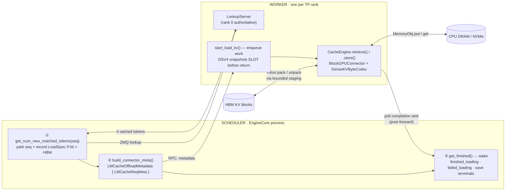
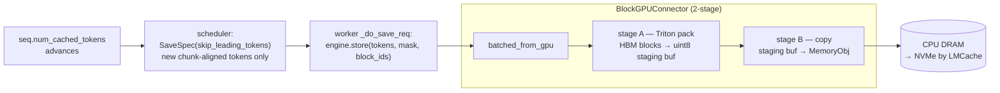
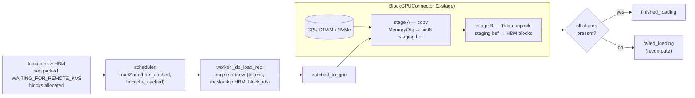
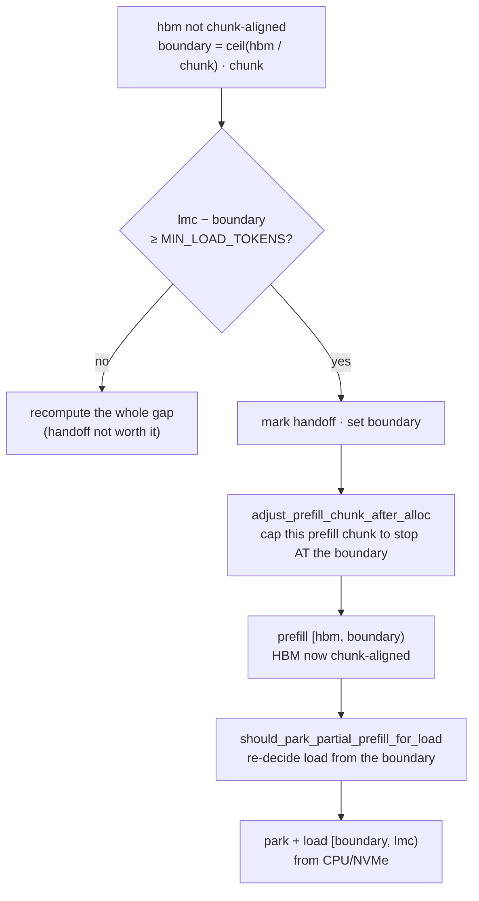

# LMCache CPU/NVMe KV Cache Offload (ATOM standalone)

This module adds a **CPU DRAM (L2) and optional NVMe (L3) cache tier** on top of
ATOM's native HBM prefix and state caches. Dense MHA/MLA continues to offload
opaque KV blocks. Stateful DeepSeek V4 (DSV4) uses a stricter pair:

- **PAGE** — page-major compressed KV from `KVTransferTensors.block_regions`,
  persisted incrementally through standard `LMCacheEngine.store/retrieve`.
- **SLOT** — one complete request-state slot from `swa_block_regions` (legacy
  field name), persisted as a fixed AOS1 sidecar.

A DSV4 boundary is reusable only when both PAGE and SLOT restore successfully.
Missing, incompatible, or corrupt sidecar data fails closed to recomputation.

The public configuration remains `kv_connector: "lmcache_offload"`. The thin
top-level shell resolves one of three layouts: `kimi_k3` when
`hf_config.model_type == "kimi_linear"` (dense paged MLA KV plus a KDA
per-request state tier), `hybrid` when `hf_config.compress_ratios` is present
(DSV4 PAGE+SLOT), and `dense` otherwise. `kv_transfer_config.offload_layout` can
override that choice without giving scheduler and worker different connector
names.

GDN/linear-attention models (`qwen3_next`, `qwen3_5_*`; e.g. Qwen3-Next,
Qwen3.5) are the one family the resolver does **not** map to a layout: they carry
a per-request recurrent state that no offload layout owns a tier for, so
restoring their KV prefix while that state stays stale is silent wrong output.
`select_offload_layout` refuses them at startup with a `ValueError` that names
the cause, rather than falling through to `dense`.

It is the **ATOM-native, in-engine** offload path: the connector plugs straight
into ATOM's scheduler/worker via the shared
[`KVConnectorFactory`](../disaggregation/factory.py), with no vLLM in the loop.
For the **vLLM-plugin** offload path (LMCache driven through vLLM's own connector
API), and for the LMCache-from-source ROCm build steps both paths need, see
[`recipes/atom_vllm/LMCache-KV-Cache-Offload.md`](../../../recipes/atom_vllm/LMCache-KV-Cache-Offload.md).

New to this module? Read top to bottom: the early sections give the big picture;
the byte-level deep dives ([Key Modules](#key-modules-in-depth),
[Relationship to LMCache](#relationship-to-lmcache-reuse-vs-override)) come later.
Unfamiliar terms are in the [Glossary](#glossary).

## Design at a Glance

Four rules carry the module:

1. **LMCache owns token chunking and storage; ATOM owns GPU byte layout.**
   PAGE traffic uses `LMCacheEngine.store()` / `retrieve()`, preserving
   LMCache's `LMCACHE_CHUNK_SIZE` cadence, token-derived keys, lookup pins,
   CPU/NVMe backends, and eviction. Dense MHA/MLA uses `DenseKVByteCodec`; DSV4
   selects `DSV4PageSlotCodec` and packs each physical block in page-major
   order: `block0.region0 || block0.region1 || ... || block1.region0 || ...`.

2. **Stateful DSV4 is PAGE+SLOT, never PAGE-only.** Registration rejects a
   half-described stateful layout. PAGE excludes request state. SLOT includes
   every byte in one complete reverse-indexed request slot: compressor state,
   every SWA ring, and DSpark field windows when present. One codec owns both
   byte layouts, but PAGE chunks and SLOT checkpoints remain separate storage
   objects with independent save cadences.

3. **AOS1 is a commit sidecar, not another token chunk.** Its content-derived
   key includes the chained prefix-block hash, a 16-byte layout fingerprint,
   and TP size/rank. A save writes/verifies PAGE first, then writes AOS1. The
   scheduler commits a boundary only after every TP rank reports the same
   sidecar save generation.

4. **The SLOT snapshot is ordered before the next `forward`.** Connector
   metadata is dispatched before the batch forward. `start_load_kv` copies the
   live Active SLOT into a bounded connector-owned staging row on the current
   CUDA stream, records an event, and submits the remaining work to a copy
   daemon. The following forward is ordered after that snapshot on the same
   stream, so it may safely mutate the shared PAGE/SLOT allocation. Once the
   staging row has completed D2H into its owned CPU frame, the temporary GPU row
   is released; PAGE publication and AOS1 storage do not retain it.

## Module Map

| File | Role |
|------|------|
| `__init__.py` | Registers the `lmcache_offload` backend with `KVConnectorFactory`. |
| `connector.py` | Public config-only `dense`/`hybrid`/`kimi_k3` selector and thin worker/scheduler delegation shells. |
| `_offload_common.py` | Shared LMCache engine construction, role validation, executors, and completion plumbing. |
| `_block_gpu_connector.py` | Family-neutral raw-block LMCache `GPUConnectorInterface`; DCP-aware bounded staging and two-stage copies. |
| `config.py` | Builds the per-rank `LMCacheEngineConfig` + `LMCacheMetadata` from `LMCACHE_*` env and `kv_transfer_config` extras. |
| `metadata.py` | Opaque PAGE allocation metadata plus PAGE/SLOT request descriptors and exact save-generation IDs. |
| `dense/connector.py` | Dense MHA/MLA worker and scheduler implementations. |
| `dense/kv_byte_codec.py` | `DenseKVByteCodec`: maps a token range → AITER KV blocks and packs/unpacks them as raw bytes. The layout-bridging core. |
| `dense/triton_kv_staging.py` | Dense fused chunk-major pack/unpack kernels. |
| `hybrid/dsv4/connector.py` | Production DSV4 PAGE+SLOT worker and scheduler implementations. |
| `hybrid/dsv4/policy.py` | DSV4 geometry/profile, PAGE/SLOT cadence, prefix hashes, fingerprint, committed-checkpoint policy, and bounded staging-row admission. |
| `hybrid/dsv4/codec.py` | `DSV4PageSlotCodec`, `DSV4CheckpointCodec`, and `DSV4CheckpointStore`: unified GPU layout plans plus AOS1 framing/storage. |
| `hybrid/dsv4/triton_page_slot.py` | Raw-`uint8` PAGE/SLOT gather/scatter kernels; PAGE is forward-indexed and SLOT is reverse-indexed. |
| `hybrid/kimi_k3/connector.py` | Kimi-K3 worker and scheduler: the dense paged-KV path plus one extra leg for the KDA per-request state tier. |
| `hybrid/kimi_k3/staging.py` | Single-entry bounded GPU staging buffer, D2H/H2D copy stream, and producer event for one flat state entry per transfer. |
| `hybrid/kimi_k3/state_object.py` | One state checkpoint as a single opaque object keyed by ATOM's own hash, bypassing LMCache's `ChunkedTokenDatabase` (state bytes are not token-sliceable). |
| `hybrid/kimi_k3/state_tier.py` | Worker-side store/load driver for the state tier on its own executor; reports store/finished/failed hash sets for the engine-side `StateOffloadIndex` to apply. |
| `atom_lmcache_staging.py` | Per-thread CUDA streams, staging buffer, ready/free events, env helpers. |

The engine-side counterpart of the state tier lives outside this directory:
`atom/model_engine/state_offload.py` holds `StateOffloadIndex`, which applies the
store/finished/failed hash sets that `hybrid/kimi_k3/state_tier.py` reports back,
so a later prefix hit knows which checkpoints the CPU tier can actually serve.

## Architecture

The connector is split across two processes, mirroring ATOM's P/D split:



### DSV4 PAGE+SLOT data model

`DeepseekV4AttentionMetadataBuilder.get_kv_transfer_tensors()` supplies three
different concepts. They must not be substituted for one another:

```text
block_regions      PAGE: physical-block units, forward indexed
swa_block_regions  SLOT: complete request-slot units, reverse indexed
                    (the field name is historical)
staging_region     compressor-only P/D staging; never a full sidecar source
```

In current DSV4 the PAGE and SLOT views may describe the same underlying HBM
allocation. They remain distinct logical regions: PAGE addresses grow from the
low end by physical block ID, while SLOT addresses grow backward from the high
end by request-group ID. The codec snapshots both geometries independently and
never treats an equal base allocation or semantic plane role as a duplicate.

For physical block IDs `[b0, b1]` and regions `[r0, r1]`, one PAGE object is:

```text
b0.r0 | b0.r1 | b1.r0 | b1.r1
```

`bytes_per_block = sum(region.unit_bytes for region in block_regions)`.
LMCache still decides token chunk boundaries and keys; the PAGE codec only
controls the bytes presented for each chunk.

One SLOT payload is:

```text
plane0 complete slot | plane1 complete slot | ... | DSpark field windows
```

`slot_bytes = sum(region.unit_bytes for region in swa_block_regions)`. The
payload intentionally contains no PAGE bytes or physical Active SLOT group ID.
Restore always targets the newly allocated request group.

### AOS1 sidecar contract

Every sidecar is a 128-byte, little-endian, zero-padded header followed by the
full SLOT payload:

```text
magic=AOS1 | version=1 | flags=0 | boundary_tokens | boundary_block_hash
payload_bytes | payload_crc32 | fingerprint[16] | tp_size | tp_rank
reserved zeros
full SLOT payload
```

The canonical identity is:

```text
atom-slot-v1:<tp_size>:<tp_rank>:<boundary_hash_hex>:<fingerprint_hex>
```

Its BLAKE2b digest becomes `CacheEngineKey.chunk_hash`; the object is stored via
the existing LMCache `StorageManager`, so it follows the configured CPU/NVMe
tier. The fingerprint covers model/layout identity, KV dtype, compression
ratios, block/slot geometry, region sizes/indexing, and TP geometry. Decode
requires exact boundary, payload size, fingerprint, and TP matches before CRC
validation. CRC32 detects accidental storage corruption; it is not
authentication.

The sidecar is also the scheduler session's logical commit record. An orphan
PAGE chunk is harmless, but an orphan sidecar could authorize incomplete PAGE
state, so save order is strict:

```text
snapshot full SLOT -> submit PAGE store -> poll PAGE visibility through B
-> submit sidecar put -> poll sidecar contains -> publish in this session
-> all TP ranks report the same SaveOperationId -> commit B
```

`store`/`batched_put` returning means submitted, not durably flushed. The
bounded visibility polls handle asynchronous `LocalDiskBackend` publication.
Successful `lookup`/`contains` establishes logical availability to this running
session; it does not certify that the backend has completed a durable media
flush.

Commit discovery is scheduler-session-local in version 1. Persisted AOS1 objects
remain harmless after scheduler restart, but are not rediscovered or reused.

### HBM L1 versus LMCache L2/L3

Native DSV4 state checkpoints are PAGE-backed and coordinated by
`PagedStateCheckpointCoordinator`; Active SLOT groups remain reserved for live
requests. They are not disabled, replaced, leased to, or populated from
LMCache. A complete native HBM hit wins without offload. LMCache PAGE+AOS1 is an
independent L2/L3 representation for a boundary no longer available as a
complete L1 checkpoint. After an LMCache restore, the request owns its new
Active SLOT directly and later native checkpoints again use PAGE units.

### Scheduler side (`LMCacheOffloadConnectorScheduler`)

Runs in the EngineCore process. It decides **what** to load/save; it never
touches GPU memory.

- **`get_num_new_matched_tokens(seq)`** — on a new request, queries the worker's
  `LookupServer` over ZMQ for how many prompt tokens LMCache holds. If the hit
  exceeds what HBM already has, it records a `LoadSpec` and returns
  `(need, True)` to **park the sequence** in `WAITING_FOR_REMOTE_KVS`. For a
  stateful DSV4 request, the PAGE hit is reduced to the newest aligned boundary
  whose sidecar hash was committed in this scheduler session; PAGE without SLOT
  is not a hit.
- **`update_state_after_alloc` / `should_park_for_load_after_alloc`** — after
  block allocation, re-reads the *real* HBM-cached count (the lookup ran before
  the HBM prefix match, so `num_cached_tokens` was stale). Loads only the gap
  `[hbm_cached, lmcache_hit)`, chunk-aligned, and only if it clears
  `OFFLOAD_MIN_LOAD_TOKENS`. Loading below the HBM floor would overwrite shared
  prefix-cache blocks → output corruption, so that floor is strict. Version 1
  skips a **stateful** LMCache load whenever that real HBM floor is nonzero:
  combining a partial HBM state checkpoint with a SLOT from a later LMCache
  boundary is not proven safe.
- **`build_connector_meta()`** — emits one `LMCacheReqMeta` per load/save into
  `LMCacheOffloadMetadata`, the snapshot forwarded to the worker each step.
  Saves walk a persistent `_save_tracker` that stores newly-computed prompt
  chunks as the computed frontier (`num_cached_tokens`) advances. DSV4 SLOT
  specs are emitted only at the aligned state cadence or terminal aligned
  prompt boundary.
- **Save/free coordination** — `should_defer_free` holds blocks until their
  in-flight save lands; `save_finished` / `load_failed` reconcile the trackers
  (a failed load lowers the save floor so the recomputed chunks get persisted).
  Every emitted save has a scheduler-lifetime `SaveOperationId`; PAGE and SLOT
  completions must match that exact generation across all TP ranks.

### Worker side (`LMCacheOffloadConnector`)

Runs in each TP-rank worker. It does the actual byte movement.

- **`register_kv_caches`** — builds `DenseKVByteCodec` for dense KV or one
  `DSV4PageSlotCodec` for DSV4 PAGE and SLOT regions, then creates the LMCache
  engine and (on rank 0) the `LookupServer`. Stateful PAGE registration also
  requires complete SLOT geometry and creates its checkpoint codec/store,
  admission pool, and fingerprint; partial initialization fails startup.
- **`start_load_kv(metadata)`** — enqueues each load on `_load_executor` and each
  save on `_save_executor`. DSV4 first issues its source-safe D2D SLOT snapshot
  on the current stream before returning; all subsequent D2H, PAGE transfer,
  encoding, and publication work stays on the executors.
- **`_do_load_req` / `_do_save_req`** — run on the daemon threads. They call
  `engine.retrieve()` / `engine.store()`, which flow through the ATOM GPU
  connector. Stateful save performs PAGE before sidecar put. Stateful load
  performs PAGE retrieve before sidecar validation/restore. Loads are
  all-or-nothing per shard and across PAGE+SLOT.
- **`get_finished()`** — polled post-forward; returns completion sets that the
  scheduler turns into wakes (see protocol below).

## Request Lifecycle

Following one request end to end ties the pieces together:

1. **Lookup.** A new request arrives; the scheduler's
   `get_num_new_matched_tokens` asks the rank-0 `LookupServer` over ZMQ how many
   prompt tokens LMCache holds. If that hit exceeds the HBM prefix cache, it
   records a `LoadSpec` and **parks** the sequence in `WAITING_FOR_REMOTE_KVS`.
2. **Decide.** After blocks are allocated, `_decide_load_after_alloc` re-checks the
   *real* HBM floor and chooses load vs. recompute (see
   [When Does a Reload Actually Happen?](#when-does-a-reload-actually-happen)).
3. **Enqueue.** `build_connector_meta` emits an `LMCacheReqMeta`; the worker's
   `start_load_kv` submits the load to the load daemon and returns — the RPC
   thread stays free to run `forward`.
4. **Move.** The daemon runs `engine.retrieve`, which drives
   `BlockGPUConnector`: MemoryObj → staging buffer → HBM blocks (Triton
   unpack), bit-identical.
5. **Wake.** Post-forward, `get_finished` returns `finished_loading` (success) or
   `failed_loading` (recompute). The scheduler wakes the seq, which prefills only
   the still-uncached **suffix**.
6. **Save.** As prefill computes new chunks, the scheduler emits saves; the save
   daemon stores them fire-and-forget to CPU/NVMe. Blocks whose free was deferred
   are released on `finished_saving`.

For stateful DSV4, step 2 additionally requires a session-committed sidecar at
the candidate boundary. The worker then loads in this order:

```text
PAGE retrieve
-> AOS1 get
-> header/boundary/fingerprint/TP/size/CRC validation
-> SLOT H2D + scatter into destination group
-> all TP workers report finished_loading
-> scheduler publishes the PAGE prefix and resumes suffix prefill
```

Any failure before the final worker completion reports `failed_loading`. The
scheduler keeps the allocated PAGE blocks/group and recomputes; it never
publishes a PAGE-only stateful prefix.

## Completion Protocol

Offload extends the P/D completion states. The mapping is the crux of
correctness — note the deliberate asymmetry vs a P/D producer:

| Worker set | Scheduler effect |
|------------|------------------|
| `finished_loading` | PAGE, and required SLOT, restored on this worker. Aggregation wakes only after all TP workers succeed. |
| `failed_loading` | This worker failed PAGE or SLOT. Once every rank is terminal, wake to **recompute** into already allocated storage. |
| `finished_saving` | This exact `SaveOperationId` finished PAGE work; release deferred PAGE blocks only when the composite save is terminal. |
| `connector_completions[atom.dsv4.checkpoint.save]` | This exact generation published or failed to publish AOS1. `succeeded=False` is failure-dominant across TP ranks; only all-rank success commits the boundary. |
| `finished_sending` | **Never used by standalone offload.** P/D producer semantics free live blocks, so `is_producer = False`. |

Save-generation identity matters because one long prefill can have multiple PAGE
saves and a later PAGE+SLOT save in flight at once. A late notification for an
earlier generation cannot release or commit the later operation.

`is_offload = True` on the scheduler opts into offload-wake (suffix prefill)
rather than the P/D decode-jump in `Scheduler.schedule()`.

## Save / Load Data Flow

**Save (HBM → CPU/NVMe), fire-and-forget after a prefill chunk computes:**



**Load (CPU/NVMe → HBM), on the TTFT critical path:**



For DSV4, the PAGE diagrams above describe only the `block_regions` branch.
The request-level SLOT branch is deliberately separate:

```text
SAVE
producer event
-> active full SLOT --D2D--> dedicated staging row
-> PAGE engine.store
-> PAGE lookup verifies coverage through boundary B
-> D2H directly into [128-byte AOS1 header | payload] CPU tensor
-> CRC + in-place header write -> DSV4CheckpointStore.put
-> staging release/quarantine -> sidecar completion generation

LOAD
PAGE engine.retrieve
-> borrow StorageManager tensor -> AOS1 validation + zero-copy payload view
-> payload-view H2D to dedicated staging row before releasing the store object
-> scatter full SLOT to destination request group
-> synchronize -> staging release/quarantine -> load completion
```

The sidecar write is last. If PAGE succeeds but staging, D2H, encoding, or
sidecar storage fails, PAGE remains a harmless uncommitted cache object. If load
retrieves PAGE but SLOT is missing or invalid, the whole stateful load fails and
the scheduler recomputes.

The SAVE sketch compresses two ownership milestones. In the implementation,
the connector releases the temporary GPU SLOT row immediately after its D2H
copy has completed and the CPU frame owns the bytes. CRC/header finalization,
PAGE visibility polling, and `DSV4CheckpointStore.put()` continue from that CPU
frame.

The GPU connector uses a **bounded** staging buffer
(`OFFLOAD_GPU_STAGING_CHUNKS` chunks, default 2) and a two-stage pipeline: while
one group copies host↔staging, the next packs/unpacks on a separate CUDA stream,
handed off via ready/free events. Transfers larger than the buffer are split into
groups, so HBM staging cost is capped regardless of prefix length.

**`OFFLOAD_GPU_STAGING_CHUNKS` sizes *each* staging buffer, and there is more than
one.** The buffer is thread-local (`threading.local`), and load and save run on
separate executors (§ worker side). So the **load path** owns one staging buffer
and the **save path** owns one per save worker — they are never shared. Resident
staging HBM is therefore:

```
staging_chunk_bytes = (LMCACHE_CHUNK_SIZE / block_size) * bytes_per_block
per_buffer_bytes    = OFFLOAD_GPU_STAGING_CHUNKS * staging_chunk_bytes
resident_HBM        ≈ (1 load + OFFLOAD_COPY_WORKERS save) * per_buffer_bytes
```

For the chunk2 run that is `2 * 16.76 MiB ≈ 33.5 MiB` per buffer × (1 load + 1
save) ≈ **67 MiB** total. Raising `OFFLOAD_GPU_STAGING_CHUNKS` speeds up transfers
but multiplies *both* buffers.

Stateful DSV4 reserves an additional persistent full-SLOT staging allocation:

```text
slot_staging_HBM = OFFLOAD_SLOT_STAGING_SLOTS * slot_bytes
slot_bytes       = sum(r.unit_bytes for r in swa_block_regions)
```

The default is one row. Raising it allows a load reservation and one or more
concurrent save snapshots to coexist, but memory grows linearly with the full
request-state slot. If no row is free, save still stores PAGE but does not
commit that SLOT boundary; load fails before touching PAGE and recomputes.

Worker save admission is separately bounded before operation metadata, a SLOT
snapshot, or executor submission is retained:

```text
admitted running + queued saves <= max_pending_saves
running full-SLOT host frames     <= OFFLOAD_COPY_WORKERS
one host frame                    = 128 bytes + slot_bytes
```

The default `max_pending_saves` is `max(2, 2 * OFFLOAD_COPY_WORKERS)`. A full
admission set is a terminal save rejection: PAGE blocks may be released, while
a requested SLOT boundary is reported failed and is never committed. Standalone
`kv_connector=lmcache_offload` also allocates no compressor-only
`ATOM_PD_STAGING_POOL`. Other connectors and composite topologies keep their
existing staging behavior; this change does not adapt them to LMCache offload.

## When Does a Reload Actually Happen?

A lookup hit does **not** guarantee a reload. After block allocation,
`_decide_load_after_alloc` re-checks the *real* HBM-cached count and picks one of
the outcomes below. Everything is quantized to `LMCACHE_CHUNK_SIZE` (default
256 tokens) because that is the granularity of an LMCache PAGE key. The
unaligned-handoff rows below apply to dense KV; stateful DSV4 takes the
`stateful_nonzero_hbm_floor` recompute guard before attempting a partial-HBM
handoff.

| Situation (`hbm` = HBM-cached, `lmc` = lookup hit) | Outcome |
|---|---|
| `lmc <= hbm` | `hbm_satisfies_after_alloc` — HBM already covers the hit; **no load**. |
| `hbm` not a multiple of `chunk` | `unaligned_hbm_prefill` — takes the **handoff** path (always on, see below): recompute up to the chunk boundary, then load the rest. |
| `lmc - hbm < OFFLOAD_MIN_LOAD_TOKENS` (default 8192) | `too_small` — reload cheaper to skip; **recompute**. |
| `hbm` aligned **and** gap large enough | `aligned_large_hit` — **load** `[hbm, lmc)` from CPU/NVMe. |

Two hard rules behind the table:

- **Never load below the HBM floor.** The lookup runs *before* the HBM prefix
  match, so the recorded `hbm_cached_tokens` is stale (often 0). We always reload
  using the post-allocation `num_cached_tokens` as the floor — loading underneath
  it would overwrite prefix-cache blocks that may be shared with other sequences,
  corrupting their output.
- **Worker re-checks alignment too.** If a load request still arrives with an
  unaligned HBM prefix, `_do_load_req` refuses it (`failed_loading` → recompute)
  rather than write a misaligned chunk.

### Unaligned HBM: prefill to the chunk boundary first, then load

For a dense request whose HBM prefix is *not* chunk-aligned, the gap
`[hbm, lmc)` cannot be loaded directly (a chunk would straddle the boundary).
The connector unconditionally computes the short stretch to the next chunk
boundary, then reloads the rest:



So the handoff splits the request: a tiny recomputed segment to reach alignment
(≤ one chunk), followed by a large reload — only taken when the post-boundary
remainder still clears `OFFLOAD_MIN_LOAD_TOKENS`, otherwise plain recompute wins.

### Save alignment

PAGE and SLOT have intentionally different cadences:

- **PAGE cadence:** every newly computed `LMCACHE_CHUNK_SIZE` frontier (256
  tokens by default). PAGE remains incremental and uses normal LMCache chunk
  keys. The unaligned prompt tail is considered only on final prefill; a
  partial trailing chunk is never persisted mid-prefill.
- **SLOT cadence:** the configured `state_checkpoint_interval_tokens` snapped
  to a common resume boundary. Define
  `snapped_state_interval = floor(state_checkpoint_interval_tokens / hash_block_size) * hash_block_size`,
  `resume_alignment = lcm(LMCACHE_CHUNK_SIZE, hash_block_size)` and
  `slot_interval = lcm(snapped_state_interval, resume_alignment)`. SLOT saves
  occur only at that interval. A terminal boundary is eligible only when it
  lands exactly on an interval rung; an off-interval terminal creates no extra
  SLOT object, and a zero interval disables SLOT saves.

`DSV4PageSlotCodec` unifies geometry, typed copy plans, and gather/scatter; it
does **not** unify persistence cadence or object identity. A normal 256-token
PAGE frontier is stored through `LMCacheEngine.store()` as standard PAGE
chunks, while a complete SLOT is stored only at its checkpoint interval as a
separate AOS1 object. Together they form one logical reusable boundary after
PAGE coverage and SLOT publication both succeed.

The scheduler caps a prefill step at a pending SLOT boundary so the snapshot is
of exactly that completion frontier. Boundaries at zero, beyond fully computed
tokens, or without a valid request group are not emitted. If boundary B is
still publishing when the forward reaches B+1, that partial prefill pauses; an
empty metadata step keeps polling B, then snapshots B+1 before any later
forward can mutate the request SLOT.

## Correctness, fp8 & Failure Handling

KV offload is unforgiving — a single mis-placed byte corrupts a model's output
silently. The design leans on a few hard invariants.

### Byte-identical round-trip

The codec moves **opaque bytes**, never re-interpreted values, so a block written
to CPU/NVMe and read back is bit-for-bit what the attention kernel wrote. This is
what lets us bypass LMCache's layout assumptions entirely. The round-trip
(including the fp8 path below) is verified to be byte-identical in
`tests/test_lmcache_offload_connector.py`.

### fp8 KV and per-block scales

Under `--kv_cache_dtype fp8`, each KV block carries its own `k_scale` / `v_scale`.
`DenseKVByteCodec` enumerates **four** segments per layer when present — `k_cache`,
`v_cache`, `k_scale`, `v_scale` — and moves them all as part of one block's bytes
(`dense/kv_byte_codec.py`). The scales travel with the quantized data, so a
reloaded fp8 block dequantizes identically; no scale is recomputed or dropped.

### Invariants enforced in code

| Invariant | Where | Why |
|-----------|-------|-----|
| `chunk_size % virtual_block_size == 0` | `metadata.py`, `_block_gpu_connector.py`, DSV4 profile | Under DCP one scheduler block ID covers `physical_block_size × dcp_size` global tokens; an LMCache chunk must contain whole virtual blocks. |
| Never load below the HBM floor | scheduler `_decide_load_after_alloc` | Loading under `num_cached_tokens` overwrites prefix-cache blocks shared with other seqs → corruption. |
| Stateful DSV4 load requires HBM floor 0 (v1) | scheduler `_decide_load_after_alloc` | One later SLOT cannot safely be combined with PAGE/state already resident at an earlier partial boundary. |
| Load is all-or-nothing per shard | worker `_do_load_req` | A half-loaded prefix is worse than none; a missing shard fails the whole load → recompute. |
| Chunk-aligned load/save only | scheduler + worker | LMCache keys are per-chunk; an unaligned write has no valid key. |
| Stateful PAGE requires a complete SLOT layout | worker registration | PAGE-only DSV4 reuse would restore compressed KV without request state. |
| PAGE coverage precedes AOS1 put | worker `_do_save_req` | The sidecar is the commit marker; it must never authorize missing PAGE chunks. |
| AOS1 identity, size, TP, and CRC match | `decode_checkpoint` | Stale geometry, wrong rank, truncation, and corruption all recompute rather than restore. |
| Exact save generations aggregate across TP | `SaveOperationId`, aggregator | A failed or delayed rank from another save cannot commit a boundary. |

### Failure handling

Every failure degrades to "lose this offload opportunity," never to a hang or a
corrupt write:

- **Save fails** — `_guard` marks the request `done_save` (instead of leaving its
  blocks pinned forever); the request simply isn't persisted this time.
- **Load fails / misses** — the worker reports `failed_loading`; the scheduler
  wakes the seq to **recompute** into its already-allocated blocks, and
  `load_failed` lowers the save floor so the recomputed `[hbm, lmc)` chunks get
  stored again rather than being treated as already-persisted.
- **PAGE present, SLOT absent/corrupt/incompatible** — stateful load reports
  `failed_loading`; the PAGE prefix is not published. Missing AOS1, CRC failure,
  fingerprint/TP/boundary/size mismatch and malformed storage objects all take
  the same recompute path. Corrupt keys are invalidated before replacement; if
  removal fails, the key stays fenced and cannot be falsely re-committed.
- **SLOT save staging exhausted** — PAGE saving proceeds, but
  a failed `atom.dsv4.checkpoint.save` completion prevents boundary commit.
  Admission never blocks the RPC thread waiting for a row.
- **One TP rank fails a sidecar save** — exact-generation aggregation reports a
  global sidecar failure after every rank is terminal; no logical commit occurs.
- **SLOT GPU completion cannot be confirmed** — the staging row is quarantined
  rather than reused, and the save/load fails closed.
- **Request aborts mid-save** — `should_defer_free` holds the blocks until the
  in-flight save lands (`finished_saving`), so a save never reads freed memory.
- **Lookup server unavailable** — `register_kv_caches` logs a warning and runs
  save-only; loads are simply never offered (lookup returns no hits).

## TP > 1 Notes

- **Lookup is rank-0-authoritative** (`cfg.lookup_server_worker_ids = [0]`). The
  connector saves on **all** ranks in lockstep, so rank 0's "is it offloaded?"
  answer is correct for the whole group; each rank then loads its own KV shard.
  Without this, the client took `min()` over per-rank lookups and a single rank
  returning 0 made the scheduler always recompute.
- **Load is all-or-nothing.** If any rank's shard is missing, `_do_load_req`
  reports `failed_loading` and the scheduler recomputes — no half-loaded state.
- **AOS1 is rank-local.** Its key and header contain TP size/rank, and its
  fingerprint also changes with TP geometry. The scheduler commits a boundary
  only when every rank reports sidecar success for the same save generation.

## Key Modules in Depth

`connector.py` (the scheduler/worker orchestration) is covered under
[Architecture](#architecture). The rest of this section details the
**byte-movement stack** — the part that makes ATOM's KV layout work with LMCache —
and the two support files.

### `dense/kv_byte_codec.py` — dense MHA/MLA layout bridge

This is the dense-path bridge. DSV4 does not synthesize this segment list; it
uses the explicit PAGE regions in the next section.

**What LMCache expects — token-major.** Its GPU connectors only accept the clean
NHD/HND family (`KV_2LTD` etc.), i.e. KV indexed roughly as
`[layer, k/v, token, head, head_dim]`, contiguous in `head_dim` then token.
`normalize_kv_and_discover_format` rejects anything else.

**What AITER actually stores — x-packed, head-major, paged.** Per layer
(`bs` = block size, `H` = local KV heads, `D` = head dim, `x = 16 // elem_bytes`,
so `x=16` for fp8 / `x=8` for bf16):

| Tensor | Shape | Notes |
|--------|-------|-------|
| `k_cache` | `(num_blocks, H, D//x, bs, x)` | head-major; `D` split into `D//x` outer × `x` inner, with `bs` between → not token-contiguous |
| `v_cache` | `(num_blocks, H, …, bs, …)` | strided, head-major (exact split is model-dependent) |
| `k_scale`, `v_scale` (fp8) | `(num_blocks, H, bs)` | one fp32 scale per (head, token) in a block |

This is a **persistent HBM storage layout** (not the transient LDS bank "swizzle"),
and is specific to this ATOM AITER path — stock vLLM's `rocm_aiter_fa` uses the
clean token-major `(2,nb,bs,H,D)` that LMCache handles natively.

**How the bridge works — gather/scatter of opaque bytes, no transcode.** The codec
never reinterprets values. A whole *block* of any of those tensors
(`tensor[block_id]`) is contiguous in memory, so one block's KV is just a set of
contiguous byte slices (per layer: K, V, and fp8 scales). The codec gathers the
blocks of an LMCache chunk into a **chunk-major `uint8`** buffer —
`[chunk: seg0 blocks | seg1 blocks | …]` — which LMCache stores as an opaque blob;
on reload it scatters the exact bytes back to the exact block slots. The only
transformation is *which bytes land where* (a paged-block gather into contiguous
chunk order), never the bit pattern — so the round-trip is byte-identical and the
AITER kernel reads back its native layout. LMCache only ever sees a `uint8` array
keyed per chunk; it needs to know nothing about `x`, heads, or paging.

**Three terms that make the rest precise:**

- **segment** — one movable per-layer KV tensor. The codec enumerates, for every
  layer, up to four: `k_cache`, `v_cache`, and (fp8) `k_scale`, `v_scale`. Flattened
  across all layers this is one ordered list — an N-layer fp8 model has `4N`
  segments (`2N` for bf16). The codec is deliberately agnostic to which kind a
  segment is; it only requires a `[num_blocks, …]` tensor whose per-block slice is
  contiguous. `seg_block_bytes = segment[0].numel() × elem_size`.
- **block** — one slot on a segment's dim 0: `segment[block_id]`, a contiguous byte
  run. `bytes_per_block` = Σ `seg_block_bytes` over all segments (one block across
  every layer/tensor).
- **MemoryObj** — LMCache's storage unit for one chunk. Here it is **not** a typed
  KV tensor but a flat, contiguous `uint8` blob of `nblocks × bytes_per_block`
  bytes (`nblocks = chunk_size / block_size`). The honest `MemoryFormat` for raw
  bytes would be `BINARY`, but LMCache's LocalCPU allocator rejects `BINARY` for a
  normal MemoryObj allocation. So we set `engine.fmt = KV_2LTD` — any format the
  allocator *accepts* — purely to pass that check; the value is otherwise inert,
  because `ATOMRawBytesLMCacheMetadata` already overrides `get_shapes`/`get_dtypes`
  to force a flat `uint8` of exactly this size. The buffer you get is the opaque
  blob we want regardless of `fmt`. Internally it is **segment-major, then
  block-major**:

  ```
  one MemoryObj  (= 1 chunk = nblocks blocks):
    [ L0.K : blk0 blk1 … blk_{n-1} ]   each blk = seg_block_bytes, raw AITER bytes
    [ L0.V : blk0 … blk_{n-1} ]
    [ L0.kS: blk0 … blk_{n-1} ]        (fp8 only)
    [ L0.vS: blk0 … blk_{n-1} ]        (fp8 only)
    [ L1.K : … ] …                     segments in codec order, all layers
  ```

  e.g. the chunk2 run: `block=32`, `chunk=256` → `nblocks=8`,
  `bytes_per_block=2,095,104` → one MemoryObj = `8 × 2,095,104 = 16,760,832` bytes.

**API & guarantees.** The two entry points are
`gpu_to_chunk_major_device_buffer` (gather) and `chunk_major_device_buffer_to_gpu`
(scatter), both moving scattered GPU blocks ↔ the chunk-major `uint8` staging
buffer described above; the segment list is built once at construction from the
registered `{layer: KVCacheTensor}`. The codec validates the block-id range,
rejects duplicate blocks, and requires a `uint8` device buffer. Both directions
**require** the Triton fused staging kernel — there is no slow Python fallback on
the production path.

### `hybrid/dsv4/{codec,triton_page_slot}.py` — unified DSV4 byte bridge

DSV4 already exposes each movable compressed-KV plane through
`block_regions` and each complete request-state plane through SLOT regions.
`DSV4PageSlotCodec` snapshots both immutable geometries. PAGE regions must be
forward indexed; SLOT regions must be reverse indexed. It creates typed PAGE,
SLOT, or composite checkpoint plans, always in item-major then region-minor
order. `bytes_per_block` is the PAGE width only and deliberately excludes SLOT.
There is no segment-major fallback and no value conversion.

The same two shared `BlockGPUConnector` entry points gather and scatter these
plans. DSV4 PAGE therefore keeps
standard LMCache incremental `store/retrieve` orchestration. PAGE explicitly
excludes compressor state, SWA, DSpark windows, and state-pool ownership.

`hybrid/dsv4/triton_page_slot.py` executes both layouts as raw-`uint8` copies.
Composite checkpoint movement is two ordered launches on the same caller-owned
stream—PAGE specialization first, then SLOT specialization—not one kernel with
a runtime direction branch. The wrappers enqueue only; synchronization and
events remain connector-owned.

The same `hybrid/dsv4/codec.py` also contains `DSV4CheckpointCodec`, which owns
deterministic rank-local keys and AOS1 framing, and `DSV4CheckpointStore`, which
puts/gets the framed object through the PAGE engine's existing
`StorageManager`. Decode fails closed on identity, geometry, size,
reserved-byte, or CRC mismatch, and LMCache object references are released
exactly once.

### `hybrid/dsv4/{connector,policy}.py` — DSV4 orchestration and policy

- **`hybrid/dsv4/connector.py`** owns PAGE-before-SLOT save/load ordering,
  connector-owned SLOT temp rows, checkpoint-store calls, completion reporting,
  and fail-closed recovery.
- **`hybrid/dsv4/policy.py`** owns physical/virtual geometry, the independent
  PAGE chunk and SLOT checkpoint grids, prefix hashes, layout fingerprint, and
  the bounded committed-checkpoint index. It also owns nonblocking temp-row
  admission and quarantines rows whose GPU completion cannot be proven.

### `dense/triton_kv_staging.py` — dense fused chunk-major pack/unpack

The dense fast path used by `DenseKVByteCodec`. Two JIT kernels (`_pack_chunk_major_kernel`,
`_unpack_chunk_major_kernel`) move every `(chunk, segment)` tile in **one launch**
instead of thousands of per-block copies.

- **Grid** — `(num_chunks × num_segments, ceil(max_tile_bytes / 1024))`: one
  program per `(chunk, segment)` per 1 KiB tile.
- **Gather/scatter** — each program resolves `block_ids[block_offset + local_block]`
  to a physical block, then byte-copies through `uint8` pointers. Operating on raw
  bytes side-steps ROCm's fp8 indexed-copy kernels entirely.
- **`_build_meta`** — precomputes segment base pointers, per-segment prefix bytes,
  and per-chunk block/byte offsets as device int64 tensors, so the kernel does
  pure address arithmetic. Also validates `device_buf` size and `block_ids` length.

### `_block_gpu_connector.py` — the LMCache `GPUConnectorInterface`

The adapter LMCache's `engine.store()` / `engine.retrieve()` actually call. It
turns LMCache's *token ranges* into ATOM *block ranges* and drives bounded
staging. Dense and DSV4 instantiate this shared adapter directly.

- **Range → blocks** — `_range_block_ids` maps a chunk's `[start, end)` tokens to
  `block_ids[start//bs : ceil(end/bs)]`, enforcing block-aligned starts.
- **Bounded, pipelined staging** — `_iter_transfer_groups` packs chunks into
  groups capped by `OFFLOAD_GPU_STAGING_CHUNKS`; `_run_staged_pipeline` runs each
  group through a two-stage, event-synced pipeline (pack stream ↔ copy stream) so
  packing the next group overlaps copying the current one.
- **save vs load** — `batched_from_gpu` = pack(Triton) → copy-to-MemoryObj;
  `batched_to_gpu` = copy-from-MemoryObj → unpack(Triton). State is thread-local,
  so the load and save executors own **separate** staging buffers (see the HBM
  formula under [Save / Load Data Flow](#save--load-data-flow)).

### `atom_lmcache_staging.py` — staging primitives

Small but load-bearing. `_ThreadTransferState` lazily creates, per thread, the two
CUDA streams (`pack_stream`, `copy_stream`) and a `_StagingBuffer` holding the
device tensor plus `ready`/`free` CUDA events that gate the pipeline hand-off.
Also the `_env_flag/_env_int/_env_optional_int` helpers that parse the `OFFLOAD_*`
knobs. This per-thread isolation is exactly why load and save never contend.

### `config.py` & `metadata.py` — wiring and descriptors

- **`config.py`** — `build_lmcache_config()` reads `LMCACHE_*` env, forces
  `use_gds=False` (cufile hangs without NVMe-GDS hardware), and sets
  `lookup_server_worker_ids=[0]` so rank 0 is the authoritative lookup answerer at
  TP>1. `build_lmcache_metadata()` fills `kv_shape` from `hf_config` and pins a
  shared `engine_id` so the scheduler's lookup client and the workers' lookup
  servers derive the **same** ZMQ socket path.
- **`metadata.py`** — `ATOMRawBytesLMCacheMetadata` overrides LMCache's allocation
  to hand out opaque `uint8` MemoryObjs (`get_shapes` returns
  `nblocks × bytes_per_block`) and asserts
  `chunk_size % virtual_block_size == 0`. The
  dataclasses `LoadSpec` / `SaveSpec` / `LMCacheReqMeta` / `LMCacheOffloadMetadata`
  are the per-request descriptors that travel scheduler → worker each step.

## Relationship to LMCache: reuse vs. override

This connector is **thin** — it reuses LMCache's storage engine wholesale and
overrides only the two seams where ATOM's KV layout is incompatible. We did **not**
fork LMCache. The single integration point is
`LMCacheEngineBuilder.get_or_create(id, config, metadata, gpu_connector, …)`: we
pass our own `metadata` and `gpu_connector` and otherwise let LMCache run.

### 1. Reused as-is (not reimplemented)

| LMCache module / class | How we use it |
|---|---|
| `lmcache.v1.config.LMCacheEngineConfig` | `from_env()` builds config from `LMCACHE_*` (`config.py`) |
| `lmcache.v1.metadata.LMCacheMetadata` | base metadata, then wrapped (see below) |
| `lmcache.v1.cache_engine.LMCacheEngineBuilder` | `get_or_create()` builds the engine; we call `engine.store()` / `engine.retrieve()` / `engine.lookup_unpin()` / `post_init()` |
| `lmcache.v1.memory_management.MemoryFormat` | `KV_2LTD` fed to `engine.fmt` (allocator check) |
| `lmcache.v1.lookup_client.factory.LookupClientFactory` | `create_lookup_server()` (worker) / `create_lookup_client()` (scheduler); client `.lookup()` / `.clear_lookup_status()` |

**Core idea:** LMCache is used as a *storage-orchestration engine*. Chunking, key
generation, lookup pins, CPU/NVMe put/get, and eviction are all left to it — one
`engine.store()` in, one `engine.retrieve()` out.

### 2. What we override / hook (the parts we had to write)

These are the only places we diverge from stock LMCache. **If you port to a new
LMCache version, these are what to re-check.**

| Ours | Replaces (LMCache default) | Why it must change | How it's wired / what changed |
|---|---|---|---|
| **`BlockGPUConnector`** | LMCache's stock vLLM `GPUConnectorInterface` (the GPU↔MemoryObj mover) | The stock connectors only emit **token-major** KV (`KV_2LTD` etc.) via `normalize_kv_and_discover_format`, which rejects ATOM's x-packed head-major AITER layout | Passed as the `gpu_connector` arg to `get_or_create`. LMCache's engine calls our `batched_from_gpu` / `batched_to_gpu` instead of its own. **This is the main hook.** |
| **`ATOMRawBytesLMCacheMetadata`** | `LMCacheMetadata`'s allocation shape/dtype | MemoryObjs must be allocated as **opaque `uint8` blobs** (`nblocks × bytes_per_block`), not typed KV tensors | Wraps the base metadata and overrides `get_shapes()` / `get_dtypes()` / `get_num_groups()`; passed as `meta` to `get_or_create` |
| **`DenseKVByteCodec`** | *(nothing — new component)* | LMCache has no concept of AITER's paged x-packed byte layout | Owned by `BlockGPUConnector`; does the actual block-byte gather/scatter via Triton |
| **`DSV4PageSlotCodec`** | *(DSV4-specific component)* | DSV4 PAGE is explicit forward-indexed `block_regions`; SLOT is complete reverse-indexed request state | Selected at DSV4 registration. One codec builds both copy-plan types, but PAGE and SLOT remain separate storage objects with separate cadences |
| **`DSV4CheckpointCodec` / `DSV4CheckpointStore`** | *(separate request-state checkpoint)* | Request state is one boundary snapshot, not token-chunked PAGE data | AOS1 uses the engine's `StorageManager` directly; it does not replace or fork `LMCacheEngine.store/retrieve` |
| `engine.fmt = KV_2LTD` + `post_init()` | the format LMCache would pick for allocation | `BINARY` (the honest format for raw bytes) is **rejected** by the LocalCPU allocator; we set an *accepted* format only to pass that check — the real shape is forced by our metadata, so the value is otherwise inert | `_offload_common.py` `build_offload_engine` |
| `get_or_create(…, lambda t,s: None, lambda o,s: o)` | LMCache's trailing token-processing / output-transform callbacks | We don't use LMCache's token-shaping hooks — our codec moves raw bytes | Passed as no-op / identity callables |
| `cfg.lookup_server_worker_ids = [0]` | default: every rank answers lookup, client takes `min()` | At TP>1 a non-rank-0 shard returning 0 would zero out a real hit; rank 0 is made authoritative | `config.py` (see [TP > 1 Notes](#tp--1-notes)) |
| `cfg.use_gds = False` | LMCache may enable cufile GDS | cufile init hangs without NVMe-GDS hardware here | `config.py` |

### 3. Fully delegated to LMCache (we never touch the implementation)

Driven only indirectly through `engine.store()` / `engine.retrieve()`:

- **StorageManager** — CPU (L2) / NVMe (L3) put/get and capacity management
- **ChunkedTokenDatabase** — token → configured `LMCACHE_CHUNK_SIZE` PAGE key generation / hashing
- **LocalCPUBackend / LocalDiskBackend** — the two storage tiers
- **lookup pins + ZMQ LookupServer/Client transport** — cross-process hit query (we call only the factory and client methods, never the implementation)
- **eviction** — the cache replacement policy

## Configuration

LMCache is driven by `LMCACHE_*` env, exactly like the vLLM recipe:

| Env | Purpose |
|-----|---------|
| `LMCACHE_LOCAL_CPU` | Enable the CPU hot-cache tier. Set `False` for NVMe-only storage. |
| `LMCACHE_MAX_LOCAL_CPU_SIZE` | CPU hot-cache/staging allocator size, GiB. This must remain greater than zero for NVMe I/O even when `LMCACHE_LOCAL_CPU=False`. |
| `LMCACHE_CHUNK_SIZE=256` | LMCache chunk size (must be a multiple of ATOM block size). |
| `LMCACHE_LOCAL_DISK` | NVMe (L3) tier path; omit together with disk size to disable. |
| `LMCACHE_MAX_LOCAL_DISK_SIZE` | NVMe tier size, GiB; must be greater than zero when a disk path is set. |

NVMe uses LMCache's host-mediated POSIX path, not GDS: HBM is staged through
the CPU allocator before `LocalDiskBackend` writes or reads the NVMe files. At
startup each worker logs the realized backend list and capacities; a configured
disk tier fails startup if `LocalDiskBackend` was not actually created.

Connector-specific tuning (env):

| Env | Default | Purpose |
|-----|:-------:|---------|
| `OFFLOAD_MIN_LOAD_TOKENS` | 8192 | Don't reload a hit smaller than this; recompute is cheaper. |
| `OFFLOAD_COPY_WORKERS` | 1 | SAVE daemon threads. LOAD is always a single thread (TTFT-critical). |
| `OFFLOAD_MAX_PENDING_SAVES` | `max(2, 2 × OFFLOAD_COPY_WORKERS)` | Positive integer bound on total admitted worker saves (running + queued), acquired before SLOT snapshot or executor submission. |
| `OFFLOAD_GPU_STAGING_CHUNKS` | 2 | Chunks per bounded GPU staging buffer. Sizes **each** buffer — load and save own separate ones, so resident HBM ≈ `(1 + OFFLOAD_COPY_WORKERS) × chunks × chunk_bytes`. |
| `OFFLOAD_GPU_STAGING_MAX_BYTES` | — | Hard cap on staging bytes (clamps the chunk count). |
| `OFFLOAD_RELEASE_GPU_STAGING_AFTER_TRANSFER` | 0 | Free the staging buffer after each transfer (lower idle HBM, higher churn). |
| `OFFLOAD_SLOT_STAGING_SLOTS` | 1 | DSV4 only: number of persistent full-SLOT GPU staging rows. Must be at least 1; HBM cost is this value × `slot_bytes`. |
| `OFFLOAD_PUBLICATION_TIMEOUT_S` | 5.0 | Finite, nonnegative maximum wait after PAGE or AOS1 submission for session visibility. `0` performs exactly one immediate probe. |
| `OFFLOAD_PUBLICATION_POLL_INTERVAL_S` | 0.01 | Finite, positive sleep interval between visibility probes; prevents busy-spinning. |
| `OFFLOAD_COMMITTED_SIDECAR_CAPACITY` | 65536 | Positive integer bound for scheduler-session AOS1 commit discovery. Oldest commits are evicted first. |
| `OFFLOAD_PROFILE` | 0 | Emit `[OFFLOAD-LOAD-PROF]` / `[OFFLOAD-SAVE-PROF]` per-transfer timing. |

`kv_transfer_config` may also override any LMCache field via a
`"lmcache.<field>": value` extra. The actual connector extra
`"slot_sidecar_staging_slots": N` overrides `OFFLOAD_SLOT_STAGING_SLOTS`, and
`"committed_sidecar_index_capacity": N` overrides
`OFFLOAD_COMMITTED_SIDECAR_CAPACITY`. `"max_pending_saves": N` overrides
`OFFLOAD_MAX_PENDING_SAVES`. All apply only to that connector.

AOS1 follows the engine's location policy exactly. Submission passes
`store_location` to `StorageManager.batched_put`; discovery searches only
`retrieve_locations`, and reads target the backend location returned by that
search. The local-CPU allocator is therefore not an implicit readable cache tier
when, for example, policy allows only `LocalDiskBackend`.

## How to Run

LMCache must be built from source for ROCm first — see
[the recipe](../../../recipes/atom_vllm/LMCache-KV-Cache-Offload.md) Step 2.

```bash
export LMCACHE_LOCAL_CPU=True
export LMCACHE_MAX_LOCAL_CPU_SIZE=200          # GiB CPU tier
export LMCACHE_CHUNK_SIZE=256
export OFFLOAD_SLOT_STAGING_SLOTS=1            # required full-SLOT staging
# Optional NVMe L3 tier:
# export LMCACHE_LOCAL_DISK=/nvme/lmcache
# export LMCACHE_MAX_LOCAL_DISK_SIZE=2000

# For an NVMe-backed tier without a CPU hot cache, use:
# export LMCACHE_LOCAL_CPU=False
# export LMCACHE_MAX_LOCAL_CPU_SIZE=8           # required host staging pool
# export LMCACHE_LOCAL_DISK=/nvme/lmcache
# export LMCACHE_MAX_LOCAL_DISK_SIZE=2000

python -m atom.entrypoints.openai_server \
  --model /path/to/model \
  --kv_cache_dtype fp8 \
  --block-size 16 \
  -tp 2 \
  --kv-transfer-config '{"kv_connector":"lmcache_offload","kv_role":"offload"}'
```

Standalone DSV4 LMCache offload supports both FP8 and FP4 indexer layouts.
FP4 PAGE objects include the packed data and separate e8m0 scale regions for
every CSA layer. FP4 remains unsupported with PD connectors such as Mooncake
or Moriio. Pipeline parallelism greater than one is also rejected; TP stores
one PAGE shard and one AOS1 sidecar per rank.

### NVMe-only standalone example

Use the following configuration to keep reusable KV on NVMe without retaining
it in the LMCache CPU hot-cache tier. `LMCACHE_MAX_LOCAL_CPU_SIZE` must still be
positive because the POSIX disk backend stages data through host memory.

Start the server in terminal 1:

```bash
export MODEL_PATH=/path/to/model
export NVME_CACHE_DIR=/mnt/nvme/lmcache
export SERVER_LOG=/tmp/atom-lmcache-nvme.log

mkdir -p "${NVME_CACHE_DIR}"
export PYTHONHASHSEED=0
export LMCACHE_LOCAL_CPU=False
export LMCACHE_MAX_LOCAL_CPU_SIZE=8
export LMCACHE_LOCAL_DISK="${NVME_CACHE_DIR}"
export LMCACHE_MAX_LOCAL_DISK_SIZE=200
export LMCACHE_CHUNK_SIZE=256
export LMCACHE_USE_GDS=False
export OFFLOAD_MIN_LOAD_TOKENS=0

python -m atom.entrypoints.openai_server \
  --model "${MODEL_PATH}" \
  --host 0.0.0.0 \
  --server-port 8000 \
  --trust-remote-code \
  --tensor-parallel-size 8 \
  --kv_cache_dtype fp8 \
  --block-size 16 \
  --max-model-len 8192 \
  --no-enable_prefix_caching \
  --kv-transfer-config '{"kv_connector":"lmcache_offload","kv_role":"offload"}' \
  2>&1 | tee "${SERVER_LOG}"
```

`LMCACHE_CHUNK_SIZE` must be divisible by `--block-size`. Native prefix caching
is disabled above so repeated requests demonstrate LMCache retrieval rather than
an HBM prefix-cache hit. It may remain enabled in production if both tiers are
desired. `OFFLOAD_MIN_LOAD_TOKENS=0` makes short validation prompts eligible for
reload; tune it upward in production when recomputing small prefixes is cheaper.

In terminal 2, wait for readiness and send requests normally:

```bash
export MODEL_PATH=/path/to/model
export NVME_CACHE_DIR=/mnt/nvme/lmcache
export SERVER_LOG=/tmp/atom-lmcache-nvme.log

curl -sf http://127.0.0.1:8000/v1/models

curl http://127.0.0.1:8000/v1/completions \
  -H 'Content-Type: application/json' \
  -d "{\"model\":\"${MODEL_PATH}\",\"prompt\":\"Repeat a sufficiently long prompt here...\",\"max_tokens\":32,\"temperature\":0}"
```

Send the same prompt again to exercise the NVMe reload path, then confirm the
realized backend topology and store/retrieve operations:

```bash
grep -E 'storage: backends|Stored [1-9]|Retrieved [1-9]|OFFLOAD-(LOAD|SAVE)-PROF' \
  "${SERVER_LOG}"
find "${NVME_CACHE_DIR}" -name '*.pt' -type f | wc -l
```

For a GSM8K validation, run the evaluator twice against the same live server.
The first pass populates NVMe and the second pass reuses the same prompt KV:

```bash
export OPENAI_API_KEY=dummy

lm_eval \
  --model local-completions \
  --model_args "model=${MODEL_PATH},base_url=http://127.0.0.1:8000/v1/completions,tokenizer=${MODEL_PATH},tokenized_requests=False,max_length=4096,num_concurrent=32,max_retries=3,trust_remote_code=True" \
  --tasks gsm8k \
  --num_fewshot 5 \
  --batch_size 1 \
  --output_path /tmp/gsm8k-pass1 \
  --log_samples
```

To require physical disk reads rather than Linux file-page-cache hits during a
controlled test, evict only this cache directory between passes. Do not drop the
host's global page cache:

```bash
python - "${NVME_CACHE_DIR}" <<'PY'
import os
import sys
from pathlib import Path

files = list(Path(sys.argv[1]).rglob("*.pt"))
for path in files:
    fd = os.open(path, os.O_RDONLY)
    try:
        os.fsync(fd)
        os.posix_fadvise(fd, 0, 0, os.POSIX_FADV_DONTNEED)
    finally:
        os.close(fd)
print(f"evicted file pages for {len(files)} LMCache chunks")
PY

lm_eval \
  --model local-completions \
  --model_args "model=${MODEL_PATH},base_url=http://127.0.0.1:8000/v1/completions,tokenizer=${MODEL_PATH},tokenized_requests=False,max_length=4096,num_concurrent=32,max_retries=3,trust_remote_code=True" \
  --tasks gsm8k \
  --num_fewshot 5 \
  --batch_size 1 \
  --output_path /tmp/gsm8k-pass2 \
  --log_samples
```

`kv_role` selects direction: `offload` (default, save + load), `kv_producer`
(save only), `kv_consumer` (load only), `kv_both`.

Send requests normally to `/v1/completions` or `/v1/chat/completions` on the
server's API port — offload is transparent to the client; reused prefixes are
served from CPU/NVMe instead of being recomputed.

## Observability and Troubleshooting

Stateful registration emits one bounded summary per rank:

```text
LMCache offload PAGE+SLOT registered rank=...
page_bytes_per_block=... slot_bytes=...
slot_staging_slots=... fingerprint=<12-hex-prefix>
```

The fingerprint is deliberately truncated and no token content, sidecar
payload, canonical key, or model data is logged. Each SLOT operation emits one
terminal message distinguishing `SLOT sidecar save published` from
`SLOT sidecar save failed`, and `SLOT sidecar load restored` from
`SLOT sidecar load failed`. “Published” means the submitted object became
visible through LMCache `contains` within the bounded policy; it does not claim
a durable backend flush. PAGE transfer timing remains opt-in with
`OFFLOAD_PROFILE=1` via
`[OFFLOAD-SAVE-PROF]` and `[OFFLOAD-LOAD-PROF]`.

Common diagnostics:

- **No PAGE+SLOT registration line:** the model did not expose DSV4
  `block_regions`, or startup rejected incomplete PAGE/SLOT geometry, PP, or
  an invalid staging count. Treat startup exceptions as
  configuration errors; do not force PAGE-only stateful operation.
- **`SLOT sidecar load missing`:** PAGE may exist, but the boundary is not
  restorable. Expected causes include a failed earlier sidecar save and
  scheduler restart (version-1 discovery is session-local). Recompute is the
  correct outcome.
- **Fingerprint, TP, boundary, payload-size, or CRC failure:** the object is
  stale, from different geometry/rank, truncated, or corrupt. Start a fresh
  cache generation; do not bypass validation.
- **`SLOT ... staging exhausted`:** all full-SLOT rows are reserved. PAGE save
  can still succeed, but no sidecar commit occurs; load recomputes. Increase
  `OFFLOAD_SLOT_STAGING_SLOTS` only after accounting for
  `slot_bytes × staging_slots` HBM.
- **`reason=stateful_nonzero_hbm_floor` in debug load-skip logs:** version 1
  intentionally skips a stateful LMCache load when allocation found a partial
  HBM prefix. This is a correctness guard, not a storage miss.
- **PAGE saved but no logical sidecar commit at TP>1:** inspect every rank's
  sidecar terminal log for the same boundary. One failed rank makes the global
  exact-generation result a failure.
- **Configured NVMe but no `LocalDiskBackend`:** startup is expected to fail.
  Verify both disk path/size and a positive local-CPU staging capacity, even
  with `LMCACHE_LOCAL_CPU=False`.

## Cache Compatibility and Migration

PAGE keys now use a deterministic model-name namespace containing an explicit
ATOM PAGE layout version plus a config fingerprint. The fingerprint covers
PAGE mode, KV/index dtype, the actual DSV4 `kv_head_dim` and `index_head_dim`,
model/compression geometry, block/chunk, TP/DCP, and speculative configuration.
Version 2 also binds the corrected virtual-DCP block mapping. Scheduler and
workers derive the same namespace; `worker_id` remains the rank-local
`CacheEngineKey` dimension. Semantic PAGE packing changes must bump
`PAGE_LAYOUT_VERSION`.

Earlier unnamespaced or differently namespaced PAGE objects are intentionally
unreachable and cannot authorize current AOS1 state. AOS1 fingerprints and keys
also bind the PAGE namespace. The current PAGE payload is block-then-region
page-major and is not byte-compatible with experimental segment-major objects;
AOS1 is not compatible with old AOB1/bundle formats. There is no fallback
decoder. A fresh disk directory is optional for cleanup/capacity reclamation,
not correctness.

Dense `DenseKVByteCodec` objects remain valid only under their matching
fingerprinted namespace. Model/layout, dtype, compression, slot geometry, or
parallel/speculation changes derive a different namespace instead of colliding
with previous bytes.

## Benchmarks

Two complementary benchmark families were used to validate offload. They measure
different things — keep them separate when reading results.

| | **CI agentic-coding** | **LMBenchmark CxS** |
|---|---|---|
| Tool | AIPerf (`aiperf profile`) | LMBenchmark `multi-round-qa.py` |
| Scenario | `inferencex-agentx-mvp`, real traces (`semianalysis_cc_traces_*_256k`) | multi-round QA over fixed docs (32K/64K/128K) |
| Prefix reuse | multi-turn trace context (~97% prefix hit) | fixed source files reused across rounds (`-c`/`-s`) |
| Shape | ISL ~100K / OSL ~500 (long-in, short-out) | per-case `ctx:c:s`, `--num-rounds 2` |
| Headline metric | throughput, TTFT p50, E2E p50, valid requests | per-round / follow-up TTFT speedup, Retrieve/Store counts |
| Compares | ATOM baseline vs offload, then vs vLLM | baseline vs CPU reload (same engine) |

### Mechanism microbench (the core evidence)

Isolated reload-vs-recompute TTFT — proves the reload itself wins on MI325X:

| Path | recompute | CPU reload | NVMe reload |
|------|----------:|-----------:|------------:|
| vLLM + LMCache | 2.50s | 0.32s (7.8×) | 0.46s (5.4×) |
| ATOM standalone (tuned) | 2.50s | **0.37s (6.8×)** | — |

### CI agentic-coding, current-code fullset run

AIPerf agentic fullset on the current connector (Triton-fused bounded staging,
`OFFLOAD_GPU_STAGING_CHUNKS=2`), MiniMax-M2.5-MXFP4, TP=1, `util=0.95`,
`conc=16`, `block=32`, 30 min. The ATOM offload column is the chunk2 run; the
ATOM baseline and the two vLLM columns are from separate runs and serve as
reference (see caveat below):

These measurements predate the DSV4 PAGE+AOS1 path and validate the dense
raw-byte connector only. `MXFP4` here describes model weights; it is not
performance evidence for the DSV4 FP4 indexer offload path.

| metric | vLLM none | ATOM baseline | vLLM LMCache | ATOM offload (chunk2) |
|--------|----------:|--------------:|-------------:|----------------------:|
| valid requests | 141 | 160 | 296 | **394** |
| total throughput (tok/s) | 7,879 | 9,043 | 16,596 | **22,317** |
| TTFT p50 | 79.7s | 75.1s | 24.1s | **20.1s** |
| E2E p50 | 123.7s | 110.9s | 54.3s | **39.6s** |

Against the ATOM baseline this is **~2.5× throughput** and **~3.7× faster TTFT
p50** — confirming ATOM CPU reload works end-to-end.

> **Comparison caveat.** The chunk2 offload run is offload-only; its baseline is a
> separate run with a slightly different prefix-hit structure (96.1% vs 94.2%), so
> the ratios are indicative, not bit-equivalent A/B. Also, `OFFLOAD_GPU_STAGING_CHUNKS=2`
> is a **low-HBM-pressure sanity config, not the throughput-optimal default**: it
> fragments a 16K-token store into up to 32 transfer groups and a long load into
> hundreds (save effective ~2.74 GiB/s p50). Larger staging is faster but uses
> more idle HBM; tune per deployment.

Exact run configuration (so the numbers reproduce):

| Knob | Value | Note |
|------|-------|------|
| model | MiniMax-M2.5-MXFP4 | |
| `kv_cache_dtype` | `fp8` | with per-block k/v scales |
| `-tp` | 1 | |
| `--block-size` | 32 | ATOM KV block |
| `LMCACHE_CHUNK_SIZE` | **256** | chunk / block = **8** (must divide evenly) |
| `--max-model-len` | 196608 | |
| `--max-num-batched-tokens` | 16384 | |
| `--attn-prefill-chunk-size` | 16384 | chunked prefill on |
| `--max-num-seqs` / concurrency | 16 | |
| `--gpu-memory-utilization` | 0.95 | tight HBM → forces eviction → exercises reload |
| `LMCACHE_MAX_LOCAL_CPU_SIZE` | 312.5 | GiB per rank |
| `OFFLOAD_MIN_LOAD_TOKENS` | 8192 | |
| `OFFLOAD_GPU_STAGING_CHUNKS` | **2** | sanity config; raise for throughput |
| prefix cache | on | |

The LMBenchmark CxS runs use the same `LMCACHE_CHUNK_SIZE=256` / `block-size=32`;
they vary only the per-case context length (32K/64K/128K) and the `-c`/`-s` reuse
factors. Vary `LMCACHE_CHUNK_SIZE` and `--block-size` together — their ratio must
stay an integer (see [Correctness invariants](#correctness-fp8--failure-handling)).

> **Validity gotchas.** An earlier agentic-coding run was **voided**: AIPerf sends
> `max_completion_tokens`, which the old ATOM API ignored and fell back to
> `DEFAULT_MAX_TOKENS=8192`, so every request over-generated to ~8K tokens. The
> table above is from the corrected rerun (API honors `max_completion_tokens`,
> returns HTTP 400 on context overflow). Always confirm `OSL mismatch = 0`.
> Likewise, never use saturated fixed-shape throughput as an offload verdict —
> use long-in/short-out + tight HBM + reusable prefix, and check the
> `OFFLOAD-LOAD-PROF` / `OFFLOAD-SAVE-PROF` counters to confirm reloads actually
> happened (`OFFLOAD_PROFILE=1`).

### Launch (A/B harness)

Both benchmarks restart the server per variant/case (and scrub `/dev/shm` +
`ipcrm` between runs — stale LMCache CPU pools and IPC segments otherwise leak
across runs). Reference A/B scripts live in the `009-kv-off-llmcache` project
workspace under `scripts/`; the essential commands are:

**CI agentic-coding** — ATOM server (offload variant) + AIPerf client:

```bash
# server: same as "How to Run", plus profiling + agentic tuning
export LMCACHE_LOCAL_CPU=True LMCACHE_MAX_LOCAL_CPU_SIZE=312.5 LMCACHE_CHUNK_SIZE=256
OFFLOAD_PROFILE=1 OFFLOAD_MIN_LOAD_TOKENS=8192 \
OFFLOAD_GPU_STAGING_CHUNKS=2 \
python -m atom.entrypoints.openai_server \
  --model /path/to/MiniMax-M2.5-MXFP4 -tp 1 --kv_cache_dtype fp8 --trust-remote-code \
  --enable_prefix_caching --enable_chunked_prefill --attn-prefill-chunk-size 16384 \
  --max-num-batched-tokens 16384 --block-size 32 --max-num-seqs 16 \
  --max-model-len 196608 --gpu-memory-utilization 0.95 \
  --kv-transfer-config '{"kv_connector":"lmcache_offload","kv_role":"offload"}'
  # baseline variant: drop the --kv-transfer-config line

# client
aiperf profile --scenario inferencex-agentx-mvp \
  --url http://127.0.0.1:8000 --endpoint /v1/chat/completions --endpoint-type chat --streaming \
  --model <MODEL> --concurrency 16 --benchmark-duration 1800 --random-seed 42 \
  --trajectory-start-min-ratio 0.25 --trajectory-start-max-ratio 0.75 \
  --use-server-token-count --tokenizer-trust-remote-code --num-dataset-entries 472 \
  --public-dataset semianalysis_cc_traces_weka_with_subagents_256k
```

**LMBenchmark CxS** — server as above, then the multi-round client per case:

```bash
cd LMBenchmark/real-multi-round-qa
python3 multi-round-qa.py \
  -c <ctx_reuse> -s <sys_reuse> \
  --src-dir <DATA>/<ctx> --num-rounds 2 --answer-len 20 --timeout 900 \
  --model <MODEL> --base-url http://127.0.0.1:8000 \
  --src-files <fixed_files> --output <out>.json
# cases swept: 32k:2:2  64k:2:4  128k:2:2  (ctx:c:s)
```

## Testing

| Test | Covers |
|------|--------|
| [`tests/test_dsv4_page_slot_codec.py`](../../../tests/test_dsv4_page_slot_codec.py) | Unified PAGE/SLOT plan layout, section offsets, forward/reverse addressing, and validation. |
| [`tests/test_dsv4_checkpoint_codec.py`](../../../tests/test_dsv4_checkpoint_codec.py) | AOS1 round trip, deterministic rank-local key, identity checks, and CRC rejection. |
| [`tests/test_dsv4_checkpoint_format.py`](../../../tests/test_dsv4_checkpoint_format.py), [`tests/test_dsv4_checkpoint_store.py`](../../../tests/test_dsv4_checkpoint_store.py) | Detailed AOS1 framing/corruption validation and LMCache StorageManager ownership. |
| [`tests/test_dsv4_staging_admission.py`](../../../tests/test_dsv4_staging_admission.py), [`tests/test_dsv4_policy.py`](../../../tests/test_dsv4_policy.py) | Bounded temp-row ownership/quarantine and checkpoint-grid policy. |
| [`tests/test_dsv4_page_slot_triton.py`](../../../tests/test_dsv4_page_slot_triton.py) | PAGE-then-SLOT launch order on one stream, enqueue-only wrappers, and GPU round trip where available. |
| [`tests/test_lmcache_offload_config.py`](../../../tests/test_lmcache_offload_config.py) | Stable PAGE namespace derivation, geometry/version separation, and scheduler/worker metadata parity. |
| [`tests/test_lmcache_offload_v4_page_slot.py`](../../../tests/test_lmcache_offload_v4_page_slot.py) | PAGE-before-SLOT save, PAGE-then-SLOT load, missing/corrupt SLOT, staging exhaustion, and bounded logs. |
| [`tests/test_lmcache_offload_connector.py`](../../../tests/test_lmcache_offload_connector.py) | Scheduler cadence, session commits, nonzero-HBM guard, exact save generations, and dense regressions. |
| [`tests/test_kv_aggregator.py`](../../../tests/test_kv_aggregator.py) | TP all-rank completion/failure and cross-generation isolation. |
| [`tests/test_lmcache_offload_disk_integration.py`](../../../tests/test_lmcache_offload_disk_integration.py) | Real-LMCache local-disk PAGE and AOS1 sidecar round trips; explicit skip without LMCache. |
| [`tests/test_lmcache_offload_gpu_disk_e2e.py`](../../../tests/test_lmcache_offload_gpu_disk_e2e.py) | Real PAGE-region + full-SLOT GPU `LocalDiskBackend` round trip; explicit prerequisite probes for ROCm/CUDA, LMCache, and Triton. |

## Known Limitations & Future Work

- **Stateful load with a nonzero HBM floor is skipped.** Version 1 does not merge
  a partial native HBM checkpoint with a later AOS1 snapshot. It recomputes for
  correctness even when LMCache has additional PAGE chunks.
- **DSV4 FP4 indexer is standalone-offload only.** LMCache PAGE geometry
  includes both packed data and e8m0 scale regions. PD transfer through
  Mooncake/Moriio still fails at startup until its producer/consumer mapping is
  extended for the separate scale pool.
- **Pipeline parallelism is unsupported for DSV4 PAGE+SLOT.** TP is supported
  with one rank-local PAGE shard and AOS1 object per rank.
- **Sidecar discovery is session-local.** A scheduler restart does not rebuild
  `_committed_sidecar_hashes`; persisted AOS1 objects are not reused across that
  restart in version 1. The in-session index is an LRU-set bounded by
  `OFFLOAD_COMMITTED_SIDECAR_CAPACITY`; an evicted boundary fails closed and
  recomputes.
- **Full-SLOT staging consumes persistent HBM.** Cost is
  `OFFLOAD_SLOT_STAGING_SLOTS × slot_bytes`, in addition to the PAGE staging
  buffers. The default one-row pool can skip a boundary under contention.
- **Per-block staging cost.** The codec stages KV one block at a time through the
  bounded buffer. For very long prefixes this dominates reload latency; a
  bulk/contiguous copy path would cut it substantially. The Triton fused
  chunk-major kernel (`dense/triton_kv_staging.py`) is the current fast path.
- **Reload only pays off above `OFFLOAD_MIN_LOAD_TOKENS`.** Small hits are skipped
  because, at the current copy speed, recompute is cheaper. The break-even point
  is workload- and hardware-dependent — tune the threshold per deployment.
- **`min_load` is ATOM-standalone only.** The vLLM-plugin path
  (`LMCacheConnectorV1`) does not consume `OFFLOAD_MIN_LOAD_TOKENS`; its analog is
  LMCache's `min_retrieve_tokens` (default 0 — no threshold).
- **GDS / NVMe-direct is disabled.** `config.py` forces `use_gds=False` (cufile
  init hangs without NVMe-GDS hardware here); the NVMe tier goes through LMCache's
  host path.

## Glossary

| Term | Meaning |
|------|---------|
| **HBM prefix cache (L1)** | ATOM's native on-GPU KV reuse. `num_cached_tokens` = how many prompt tokens it already holds for a request. |
| **Native PAGE state checkpoint (L1)** | `PagedStateCheckpointCoordinator`-managed HBM state snapshots. They remain enabled and independent of LMCache sidecars. |
| **HBM-cached (`hbm`)** | Tokens resident in the HBM prefix cache for this request — the floor a load must never go below. |
| **lookup hit / lmcache-cached (`lmc`)** | Tokens LMCache holds in CPU/NVMe for this request's prefix, reported by the lookup. |
| **chunk** | LMCache PAGE storage/key granularity (`LMCACHE_CHUNK_SIZE`, default 256). One MemoryObj per chunk. |
| **block** | ATOM's KV paging unit (`--block-size` tokens). `chunk = chunk_size / block_size` blocks. |
| **PAGE** | Incremental token-chunked KV bytes. DSV4 packs explicit `block_regions` page-major. |
| **SLOT** | One complete request-state snapshot: compressor state, SWA, and DSpark windows where present. |
| **AOS1** | Version-1 fixed SLOT sidecar frame and commit object. |
| **segment** | Dense-path movable tensor (`k_cache`/`v_cache`/scales); not the DSV4 PAGE representation. |
| **shard** | One TP rank's slice of a layer's KV. Loads are all-or-nothing across shards. |
| **park** | Suspend a sequence in `WAITING_FOR_REMOTE_KVS` until its load completes. |
| **suffix prefill / offload-wake** | Resuming a parked seq to prefill only the still-uncached suffix (vs the P/D decode-jump). |
| **P/D** | Prefill/Decode disaggregation — the sibling connector this module shares base/factory/types with. |
| **RPC thread** | The worker thread that runs per-step engine calls. DSV4 only enqueues the source-safe SLOT D2D snapshot there; blocking D2H/storage work runs on daemons. |
| **completion sets** | `finished_loading` / `failed_loading` plus exact-generation PAGE/SLOT save sets, aggregated across TP workers. |

## See Also

- [`recipes/atom_vllm/LMCache-KV-Cache-Offload.md`](../../../recipes/atom_vllm/LMCache-KV-Cache-Offload.md)
  — vLLM-plugin offload path, LMCache ROCm build, benchmark numbers.
- [`../disaggregation/README.md`](../disaggregation/README.md) — the sibling P/D
  disaggregation connector this module's factory/base/types are shared with.
- `atom/model_ops/attentions/aiter_attention.py` — the AITER KV layout the byte
  codec round-trips.
